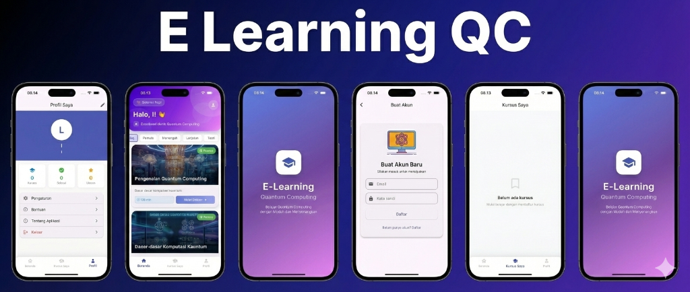
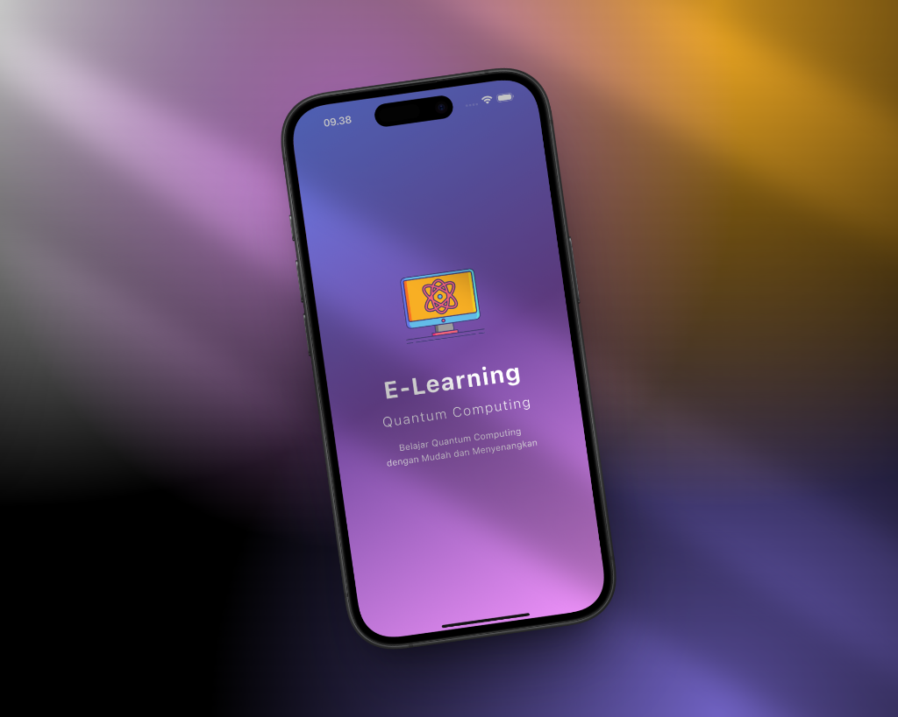
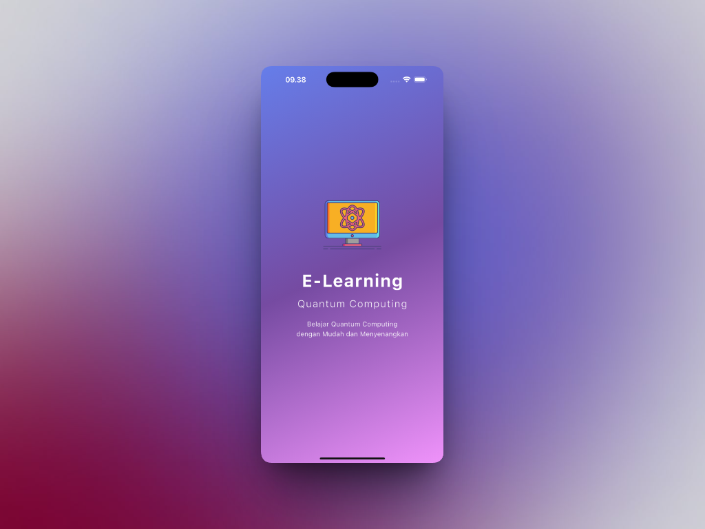
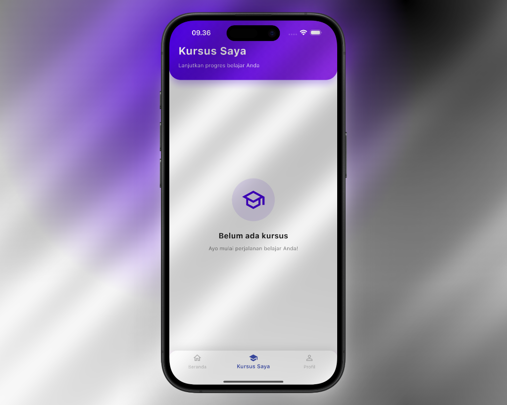
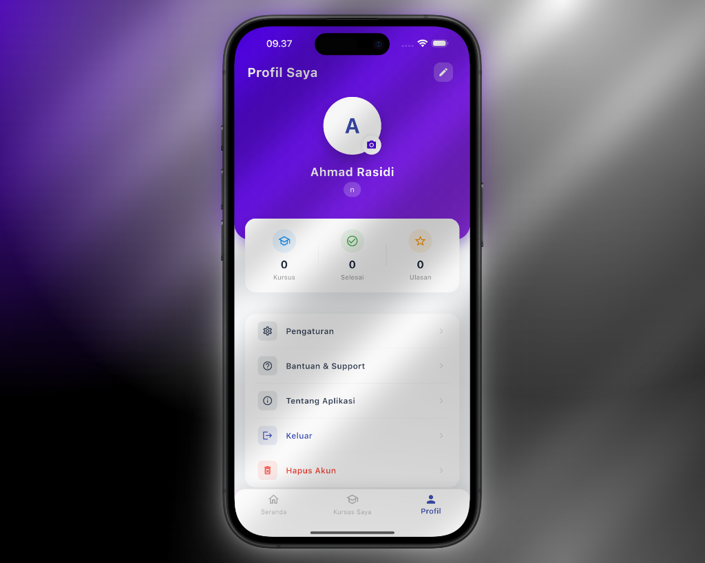

# Quantum Computing E-Learning

A full-stack mobile e-learning application focused on Quantum Computing education. Built as a final project for Programming III course, Semester 3, Faculty of Engineering Computer Science University Of Bumigora.

## Project Overview

This project implements a complete e-learning platform that delivers educational content about Quantum Computing concepts. The system features user authentication, course management, lesson tracking, progress monitoring, and user reviews.

## Technology Stack

| Layer | Technology |
|-------|------------|
| Mobile Frontend | Flutter (Dart) |
| Backend API | PHP (REST API) |
| Database | MySQL |
| Local Server | XAMPP |

## Database Schema

The application uses a relational database with 8 interconnected tables:

| Table | Description |
|-------|-------------|
| `pengguna` | User accounts and authentication data |
| `kursus` | Course information including title, description, and metadata |
| `kategori` | Course categories (Beginner, Intermediate, Advanced) |
| `kursus_kategori` | Many-to-many relationship between courses and categories |
| `pelajaran` | Individual lessons within each course |
| `pendaftaran` | User enrollment records |
| `progres` | Lesson completion tracking per user |
| `ulasan` | User reviews and ratings for courses |

## Features

### Authentication
- User registration with email validation
- Secure login with password hashing
- Session management

### Course Management
- Browse courses by category
- View detailed course information
- Course thumbnails and theme colors

### Learning System
- Sequential lesson navigation
- Markdown content rendering
- Mathematical equation support (LaTeX)
- Progress tracking per lesson

### User Features
- Enroll and unenroll from courses
- Track learning progress
- Submit and manage course reviews
- Profile management with photo upload
- Reset progress functionality
- Account deletion

## Project Structure

```
elearning_qc_api/
├── backend/
│   ├── auth/           # Login and registration endpoints
│   ├── config/         # Database configuration
│   ├── kategori/       # Category CRUD operations
│   ├── kursus/         # Course CRUD operations
│   ├── pelajaran/      # Lesson CRUD operations
│   ├── pendaftaran/    # Enrollment management
│   ├── pengguna/       # User profile management
│   ├── progres/        # Progress tracking
│   ├── ulasan/         # Review management
│   ├── sql/            # Database setup scripts
│   └── uploads/        # User uploaded files
└── frontend/
    └── lib/
        ├── screens/    # UI screens
        ├── services/   # API service layer
        └── main.dart   # Application entry point
```

## API Endpoints

### Authentication
| Method | Endpoint | Description |
|--------|----------|-------------|
| POST | `/auth/login.php` | User login |
| POST | `/auth/register.php` | User registration |

### Courses
| Method | Endpoint | Description |
|--------|----------|-------------|
| GET | `/kursus/get_kursus.php` | Get all courses |
| GET | `/kursus/get_detail_kursus.php` | Get course details |
| GET | `/kursus/get_kursus_by_kategori.php` | Filter courses by category |
| POST | `/kursus/tambah_kursus.php` | Add new course |
| PUT | `/kursus/edit_kursus.php` | Update course |
| DELETE | `/kursus/hapus_kursus.php` | Delete course |

### Lessons
| Method | Endpoint | Description |
|--------|----------|-------------|
| GET | `/pelajaran/get_pelajaran.php` | Get lessons for a course |
| GET | `/pelajaran/get_detail_pelajaran.php` | Get lesson content |
| POST | `/pelajaran/tambah_pelajaran.php` | Add new lesson |
| PUT | `/pelajaran/edit_pelajaran.php` | Update lesson |
| DELETE | `/pelajaran/hapus_pelajaran.php` | Delete lesson |

### Enrollment
| Method | Endpoint | Description |
|--------|----------|-------------|
| POST | `/pendaftaran/daftar.php` | Enroll in course |
| POST | `/pendaftaran/batal_daftar.php` | Cancel enrollment |
| GET | `/pendaftaran/get_kursus_user.php` | Get enrolled courses |
| GET | `/pendaftaran/cek_status.php` | Check enrollment status |

### Progress
| Method | Endpoint | Description |
|--------|----------|-------------|
| POST | `/progres/update_progres.php` | Update lesson progress |
| GET | `/progres/get_progres.php` | Get user progress |
| POST | `/progres/reset_progres.php` | Reset course progress |

### Reviews
| Method | Endpoint | Description |
|--------|----------|-------------|
| POST | `/ulasan/tambah_ulasan.php` | Submit review |
| GET | `/ulasan/get_ulasan.php` | Get course reviews |
| PUT | `/ulasan/edit_ulasan.php` | Update review |
| DELETE | `/ulasan/hapus_ulasan.php` | Delete review |

### User Profile
| Method | Endpoint | Description |
|--------|----------|-------------|
| PUT | `/pengguna/update_profil.php` | Update profile |
| POST | `/pengguna/upload_foto.php` | Upload profile photo |
| DELETE | `/pengguna/hapus_akun.php` | Delete account |

## Prerequisites

- XAMPP (Apache + MySQL)
- Flutter SDK (>=2.18.0)
- PHP 7.4 or higher
- MySQL 5.7 or higher

## Installation

### Backend Setup

1. Clone this repository to your XAMPP htdocs directory:
   ```bash
   cd /path/to/xampp/htdocs
   git clone https://github.com/rasidi3112/Quantum-Computing-E-learning-.git elearning_qc_api
   ```

2. Start Apache and MySQL services in XAMPP.

3. Create the database by executing the SQL scripts in order:
   ```sql
   -- Run in phpMyAdmin or MySQL CLI
   source backend/sql/database_setup.sql
   source backend/sql/001_insert_kategori.sql
   source backend/sql/002_sync_kursus_kategori.sql
   source backend/sql/003_insert_kursus_quantum.sql
   ```

4. Configure database connection in `backend/config/database.php`:
   ```php
   $host = 'localhost';
   $dbname = 'elearning_qc';
   $username = 'root';
   $password = '';
   ```

### Frontend Setup

1. Navigate to the frontend directory:
   ```bash
   cd elearning_qc_api/frontend
   ```

2. Install dependencies:
   ```bash
   flutter pub get
   ```

3. Update the API base URL in `lib/services/api_service.dart` to match your server configuration.

4. Run the application:
   ```bash
   flutter run
   ```

## CRUD Operations Summary

Full Create, Read, Update, Delete operations are implemented for all major entities:

| Entity | Create | Read | Update | Delete |
|--------|--------|------|--------|--------|
| Users | Yes | Yes | Yes | Yes |
| Courses | Yes | Yes | Yes | Yes |
| Categories | Yes | Yes | Yes | Yes |
| Lessons | Yes | Yes | Yes | Yes |
| Enrollments | Yes | Yes | - | Yes |
| Progress | Yes | Yes | Yes | Yes |
| Reviews | Yes | Yes | Yes | Yes |

## Dependencies

### Flutter Packages
- `http` - HTTP client for API requests
- `flutter_markdown` - Markdown content rendering
- `flutter_math_fork` - LaTeX mathematical equation rendering
- `image_picker` - Profile photo selection

## Screenshots

### Application Overview



### Individual Screens

| Splash Screen | Welcome Screen |
|---------------|----------------|
|  |  |

| My Courses | Profile |
|------------|---------|
|  |  |

## Course Requirements Compliance

This project fulfills the following academic requirements:

- Minimum 7 database tables (implemented: 8 tables)
- Complete CRUD operations for all entities
- User authentication system
- Mobile application with Flutter
- Backend API with PHP
- MySQL database integration

## License

This project is developed for educational purposes as part of academic coursework.

---

Developed for Programming III Final Project | Faculty of Engineering Computer Science | Semester 3
